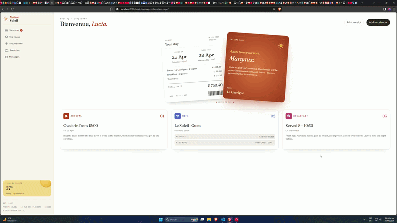

# Frontend Mentor - Hotel booking confirmation page solution

This is a solution to the [Hotel booking confirmation page challenge on Frontend Mentor](https://www.frontendmentor.io/challenges/hotel-booking-confirmation-page).

[Live Site Demo](https://quirozdev.github.io/hotel-booking-confirmation-page/)

## Table of contents

- [Overview](#overview)
  - [The challenge](#the-challenge)
  - [Links](#links)
- [My process](#my-process)
  - [Built with](#built-with)
- [Author](#author)

## Overview

### The challenge

Users should be able to:

- View the optimal layout for the interface depending on their device's screen size
- See hover and focus states for all interactive elements on the page
- Open and close the navigation menu on smaller screens (optional JavaScript)
- Copy the Wi-Fi password to their clipboard using the copy button (optional JavaScript)

### Links

- <a href="https://github.com/Quirozdev/hotel-booking-confirmation-page" target="_blank">Solution URL</a>
- <a href="https://quirozdev.github.io/hotel-booking-confirmation-page/" target="_blank">Live Site URL</a>

## My process

### Built with

- React and Typescript
- TailwindCSS
- Responsive design
- CSS Grid
- CSS Flex

## Author

- GitHub - <a href="https://github.com/Quirozdev" target="_blank">Quirozdev</a>
